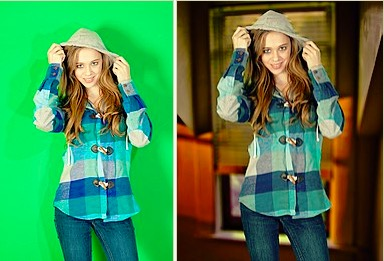

# 【小案例】基于色键技术的纯客户端实时蒙版弹幕

> 导读：本文内容是笔者最近实现的 web 端弹幕组件—— [Barrage UI](https://link.juejin.im/?target=https%3A%2F%2Fgithub.com%2Fparksben%2Fbarrage) 的一个延伸。在阅读本文的实例和相关代码之前，不妨先浏览项目文档，对组件的使用方式和相关接口进行了解。

各位童鞋如果经常上 B 站（[bilibili.com](https://www.bilibili.com/)） ，应该对 **蒙版弹幕** 这个概念并不陌生。

蒙版弹幕 是由知名弹幕视频网站 bilibili 于 2018 年中推出的一种弹幕渲染效果，可以有效减少弹幕文字对视频主体信息的干扰。

关于 B 站蒙版弹幕的实现原理，其实网上已经有很多细致的讨论和研究。个人总结了一下，大致要点如下：

1. 基于用户数据和一些机器学习的相关应用，可以提炼出视频的关键主体
2. 服务端预先对视频进行处理，并生成相应的蒙版数据
3. 客户端播放视频时，实时地加载对应资源
4. 通过一些前端的技术手段，实现弹幕的蒙版处理

客户端方面，由于 B 站弹幕是基于 div+css 的实现，因而采用了 svg 格式来传输矢量蒙版（至少目前是这样），通过 CSS 遮罩的方式实现渲染。

逼乎上有一篇关于这个方案的讨论，感兴趣的童鞋可以移步 [这里](https://www.zhihu.com/question/279446628) 进行了解。

## Barrage UI

[Barrage UI](https://link.juejin.im/?target=https%3A%2F%2Fgithub.com%2Fparksben%2Fbarrage) 是个人最近实现的一个前端弹幕组件，主要用于在前端页面中挂载弹幕动画。

组件提供了一系列的操作接口以方便用户对弹幕的相关特性进行定制。你也可以在渲染层面对动画中的每一帧图像进行处理，比如：

1. 实时读取视频信息
2. 对每一帧视频图像进行实时处理，计算出抠图蒙版
3. 将计算出的蒙版传给弹幕组件，以实现实时的蒙版弹幕

下面是基于 Barrage UI 组件实现的蒙版弹幕效果：


由于文中不方便嵌入视频，Demo 的实际效果请移步到 [此处](https://parksben.github.io/masking-danmaku-demo) 查看。

下面我们来介绍如何实现上图的动画效果。

## 色键（色度键控）

Demo 中使用了初音小姐姐跳舞的视频。最主要的特点是除了人物外，视频的背景是比较一致的纯色。对于这种类型的图像，我们可以使用 **色键** 的方式进行抠图（生成“蒙版”）。

[色度键控](https://zh.wikipedia.org/zh/%E8%89%B2%E9%94%AE)，又称色彩嵌空，是一种去背合成技术。Chroma 为纯色之意，Key 则是抽离颜色之意。把被拍摄的人物或物体放置于绿幕的前面，并进行去背后，将其替换成其他的背景。此技术在电影、电视剧及游戏制作中被大量使用，色键也是虚拟摄影棚（Virtual studio）与视觉效果（Visual effects）当中的一个重要环节。

下图是色键技术的一个示例：在绿幕前穿着蓝色衣服的小姐姐，左图为去背前，右图为去背后的新背景。



### 如何扣取视频图像

在浏览器环境中，我们可以通过 canvas 画布实时地绘制视频的每一帧，并从画布中读取到图像中每个像素的 RGBA 信息，检测每个点的 R(red)、G(green)、B(blue) 值是否满足要求，最终将需要扣除的像素的 A(alpha) 值置为 0，即可得到用于合成蒙版弹幕的蒙版图像。

> **注意：**

Barrage UI 组件的蒙版功能是基于 Canvas 2D API 的 [`CanvasRenderingContext2D.globalCompositeOperation`](https://developer.mozilla.org/zh-CN/docs/Web/API/Canvas_API/Tutorial/Compositing) 属性实现的（使用了 `source-in` 的混合模式），因而只需将不需要的像素设置为透明（alpha=0）即可，并不需要改变图像的 RGB 色值。

下面介绍此案例的代码实现。

## 具体实现

### 安装 Barrage UI 组件

直接使用 yarn 或 npm 安装此组件：

`yarn add barrage-ui` or `npm install --save barrage-ui`

### HTML + CSS

准备一个 `video` 元素用于播放视频，`video` 的父级元素用于挂载弹幕：

```html
<div id="container">
  <video id="video" src="videos/demo.mp4" controls></video>
</div>
```

根据视频的实际尺寸（880×540）设置 `#container` 与 `#video` 的样式：

```css
html,
body {
  font: 14px/18px Helvetica, Arial, 'Microsoft Yahei', Verdana, sans-serif;
  width: 100%;
  margin: 0;
  padding: 0;
  background: #eee;
  overflow: hidden;
}

#container,
#video {
  width: 880px;
  height: 540px;
}

#container {
  margin: 0 auto;
  margin-top: 50vh;
  margin-left: 50vw;
  transform: translate(-50%, -50%);
  background-color: #ddd;
}
```

### 创建弹幕

```js
import Barrage from 'barrage-ui';
import data from 'utils/mockData';

// 获取父级容器
const container = document.getElementById('container');

// 创建弹幕实例
const barrage = new Barrage({
  container: container,
});

// 重置画布高度，避免弹幕遮挡视频播放控件
barrage.canvas.height = container.clientHeight - 80;

// 装填弹幕数据
barrage.setData(data);
```

其中，mockData 是用于生成随机弹幕数据的方法。

> 关于弹幕数据的内容与格式，详见 [Barrage UI 项目文档](https://github.com/parksben/barrage#%E8%A3%85%E5%A1%AB%E5%BC%B9%E5%B9%95)

### 实时获取视频图像

```js
// 获取 video 元素
const video = document.getElementById('video');

// 新建一个画布来实时绘制视频（纯绘图，不用添加进页面）
const vCanvas = document.createElement('canvas');
vCanvas.width = video.clientWidth;
vCanvas.height = video.clientHeight;
const vContext = vCanvas.getContext('2d');

// 实时绘制视频到画布
barrage.afterRender = () => {
  vContext.drawImage(video, 0, 0, vCanvas.width, vCanvas.height);
};
```

使用组件提供的渲染周期钩子 `.afterRender()` 可以在弹幕动画的每一帧图像渲染后，将视频图像绘制到中间画布 `vCanvas` 上。注意这里的 `vCanvas` 画布主要用于实时地获取视频图像，并不需要添加到页面中。

### 实时计算蒙版信息

```js
// 渲染前读取画布 vCanvas 的数据，并处理为蒙版图像
barrage.beforeRender = () => {
  // 读取图像
  const frame = vContext.getImageData(0, 0, vCanvas.width, vCanvas.height);

  // 图像总像素个数
  const pxCount = frame.data.length / 4;

  // 将 frame 构造成我们需要的蒙版图像
  for (let i = 0; i < pxCount; i++) {
    // 这里不用 ES6 解构赋值的写法，主要为了保证性能
    // PS: 这里如果用解构赋值语法将导致大量新对象的创建，是个很耗时的过程
    const r = frame.data[i * 4 + 0];
    const g = frame.data[i * 4 + 1];
    const b = frame.data[i * 4 + 2];

    // 将黑色区域以外的内容设为透明
    if (r > 15 || g > 15 || b > 15) {
      frame.data[4 * i + 3] = 0;
    }
  }

  // 设置蒙版
  barrage.setMask(frame);
};
```

使用组件提供的渲染周期钩子 `.beforeRender()` 可以在弹幕动画的每一帧图像渲染前计算出蒙版图像。其中，用于更新蒙版的接口为 `.setMask()`。

### 视频、弹幕的操作绑定

最后，为了让弹幕的行为与视频播放的操作协同，还需要进行一些绑定的操作：

```js
// 绑定播放事件
video.addEventListener(
  'play',
  () => {
    barrage.play();
  },
  false
);

// 绑定暂停事件
video.addEventListener(
  'pause',
  () => {
    barrage.pause();
  },
  false
);

// 切换播放进度
video.addEventListener(
  'seeked',
  () => {
    barrage.goto(video.currentTime * 1000);
  },
  false
);
```

这里分别用到 Brrage UI 组件的 `.play()` `.pause` `.goto()` 三个接口，分别用于**播放**、**暂停**和**切换**弹幕动画的进度。需要注意的是，通过 `video.currentTime` 属性获取到的视频播放进度是一个单位为 **秒** 的浮点数，需要转换为 **毫秒数** 再传给弹幕组件。

## 源码奉上

本文的案例已上传 github，感兴趣的童鞋可以点击 [这里](https://github.com/parksben/masking-danmaku-demo) 查看源码细节。

关于 Barrage UI 组件如果有什么建议和疑问，欢迎大家在项目中提 issue 给我，帮助我持续改进和迭代，更欢迎 star 和 PR。

> 感谢您能耐心读到此处，如果觉得有趣或有用，不妨 **点赞**/**评论**/**转发** 此文，再谢。
